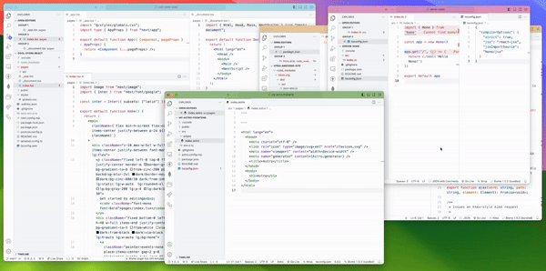
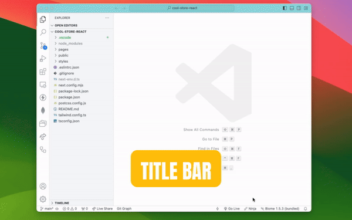
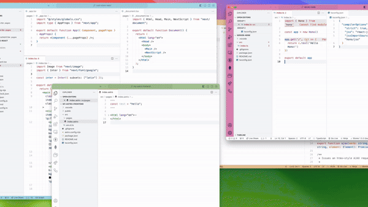
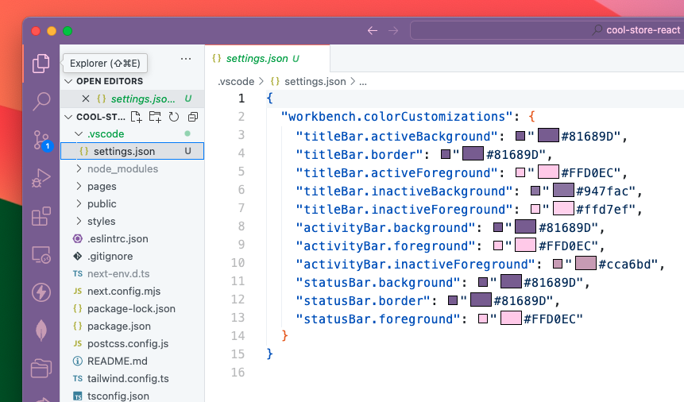
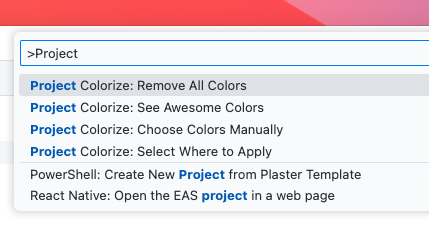

# Project Colorize

Don't get lost between windows again! Customize the main window bars with our awesome themes, designed to complement both Light/Dark themes, or choose your own colors.

## Download

Uploading to VSC Marketplace...

## Features

- Apply colors to the title bar, activity bar or status bar—or to all of them! It helps to preserve the essence of the original theme.

- Choose from more than 15 incredible themes that automatically change when you switch between a Light/Dark theme.

- If you prefer your own colors, you can enter the hex color. They will be saved with a slightly opacity when the window is inactive! Isn't that cool?

- Automatically saves the configuration in your project folder, under `.vscode/settings.json`. So it will only affect to the current project.

## Usage

1. Open the command palette (`Ctrl+Shift+P` or `Cmd+Shift+P`).

2. Type in the bar: `Project Colorize`, you will see four options:

- `Project Colorize: See Awesome Colors`
- `Project Colorize: Choose Colors Manually`
- `Project Colorize: Select Where to Apply`
- `Project Colorize: Remove All Colors`

## Uninstall

When the extension is deactivated, automatically removes all colors and configurations saved by this extension.

## Donations

If you liked the extension, I would appreciate a matcha. :)

